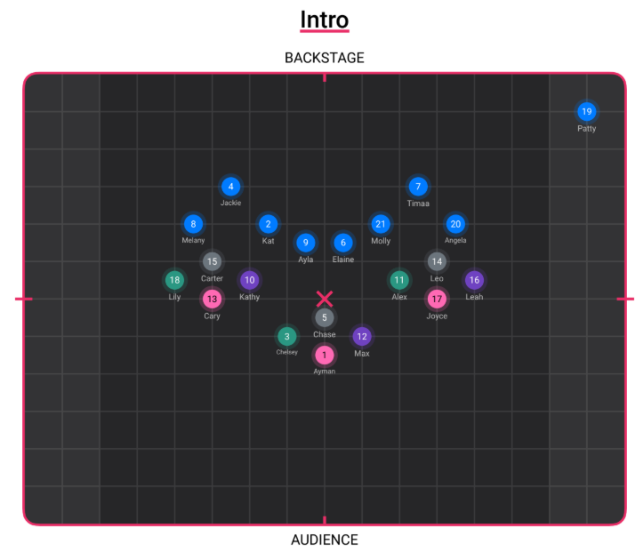
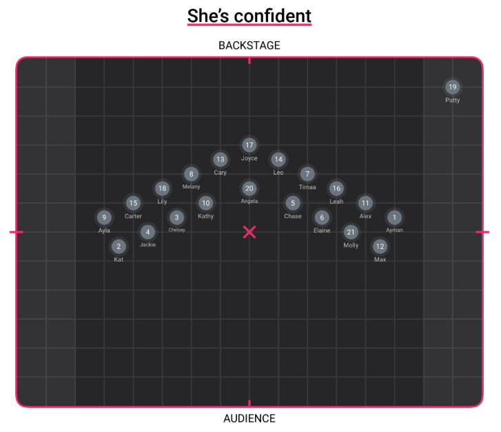

# FormFlow — AI-Powered Dance Formation Planner

<p align="center">
  <strong>Plan, visualize, and perfect dance formations with the power of AI.</strong>
</p>

<p align="center">
  
  
  
  
  
</p>

---

## Table of Contents

- [Overview](#overview)
- [Key Features](#key-features)
- [Tech Stack](#tech-stack)
- [Prerequisites](#prerequisites)
- [Quick Start](#quick-start)
- [Project Structure](#project-structure)
- [Screenshots](#screenshots)
- [API Documentation](#api-documentation)
- [Architecture](#architecture)
- [Contributing](#contributing)
- [License](#license)

---

## Overview

**FormFlow** is a full-stack web application that helps choreographers, dance captains, and team directors plan and manage stage formations. Users can visually place dancers on a 2D stage canvas, create ordered sequences of formations, sync them to music timestamps, and leverage AI to auto-generate formations, suggest smooth transitions, and ensure equitable center-time distribution across all dancers.

Whether you're choreographing a K-pop cover, a marching band halftime show, or a competition dance routine, FormFlow eliminates the tedious manual diagramming process and replaces it with an intuitive, collaborative, and intelligent planning tool.

---

## Key Features

| Feature | Description |
|---|---|
| **Visual Stage Canvas** | Drag-and-drop dancers on an interactive 2D stage with grid snapping and zoom controls. |
| **Formation Sequencing** | Create, reorder, and manage an ordered list of formations that form your routine timeline. |
| **AI Formation Generation** | Generate formations from natural-language style prompts (e.g., "V-shape with leads in front"). |
| **Template Library** | Instantly apply common formation templates — V-shape, arc, circle, diamond, diagonal, and more. |
| **Transition Suggestions** | AI-powered pathfinding that suggests smooth dancer movement paths between formations. |
| **Center-Time Analytics** | Track how much time each dancer spends near center stage; auto-rebalance for fairness. |
| **Music Integration** | Upload audio tracks, place time markers, and link formations to specific musical moments. |
| **Export & Share** | Export individual formations as PNG/JPG, or the full routine as a paginated PDF timeline. |
| **Project Management** | Organize multiple routines as separate projects, each with their own dancers and formations. |

---

## Tech Stack

### Frontend (`/client`)

| Technology | Purpose |
|---|---|
| [React 18](https://react.dev/) | UI component library |
| [Vite 5](https://vitejs.dev/) | Build tool & dev server |
| [TypeScript](https://www.typescriptlang.org/) | Type-safe JavaScript |
| [Zustand](https://zustand-demo.pmnd.rs/) | Lightweight state management |
| [React Router v6](https://reactrouter.com/) | Client-side routing |
| [Konva.js](https://konvajs.org/) / react-konva | HTML5 Canvas for stage rendering |
| [Tailwind CSS](https://tailwindcss.com/) | Utility-first CSS framework |
| [Lucide React](https://lucide.dev/) | Icon library |

### Backend (`/server`)

| Technology | Purpose |
|---|---|
| [Python 3.10+](https://www.python.org/) | Runtime |
| [FastAPI](https://fastapi.tiangolo.com/) | Async web framework |
| [SQLAlchemy 2.0](https://www.sqlalchemy.org/) | ORM / database toolkit |
| [SQLite](https://www.sqlite.org/) | Embedded relational database |
| [Pydantic v2](https://docs.pydantic.dev/) | Data validation & serialization |
| [OpenAI API](https://platform.openai.com/) | AI formation generation |
| [Pillow](https://python-pillow.org/) | Image export rendering |
| [ReportLab](https://www.reportlab.com/) | PDF generation |

---

## Prerequisites

Before running FormFlow, make sure you have the following installed:

- **Node.js 18+** — [Download](https://nodejs.org/)
- **npm 9+** (ships with Node.js) or **pnpm**
- **Python 3.10+** — [Download](https://www.python.org/downloads/)
- **pip** (ships with Python)
- **OpenAI API Key** — [Get one here](https://platform.openai.com/api-keys)

---

## Quick Start

### 1. Clone the Repository

```bash
git clone <repository-url>
cd form_gen
```

### 2. Start the Backend

```bash
# Navigate to the server directory
cd server

# Create and activate a virtual environment
python -m venv venv

# Windows
venv\Scripts\activate

# macOS / Linux
# source venv/bin/activate

# Install dependencies
pip install -r requirements.txt

# Create your .env file
cp .env.example .env
# Edit .env and add your OPENAI_API_KEY

# Run database migrations (first time only)
python -m alembic upgrade head

# Start the development server
uvicorn app.main:app --reload --port 8000
```

The API will be available at `http://localhost:8000`.
Interactive API docs at `http://localhost:8000/docs`.

### 3. Start the Frontend

```bash
# In a new terminal, navigate to the client directory
cd client

# Install dependencies
npm install

# Create your .env file
cp .env.example .env
# Ensure VITE_API_BASE_URL=http://localhost:8000 is set

# Start the dev server
npm run dev
```

The app will be available at `http://localhost:5173`.

### 4. Open in Browser

Navigate to [http://localhost:5173](http://localhost:5173) and create your first project!

---

## Project Structure

```
form_gen/
├── README.md                        # This file
├── .gitignore                       # Git ignore rules
│
├── docs/                            # Project documentation
│   ├── API_CONTRACT.md              # Complete REST API contract
│   ├── ARCHITECTURE.md              # System architecture overview
│   └── reference/                   # Design reference images
│       ├── dance_pic_1.png
│       └── dance_pic_2.png
│
├── client/                          # React + Vite frontend
│   ├── index.html                   # HTML entry point
│   ├── package.json                 # Node.js dependencies & scripts
│   ├── tsconfig.json                # TypeScript configuration
│   ├── vite.config.ts               # Vite build configuration
│   ├── tailwind.config.js           # Tailwind CSS configuration
│   ├── .env.example                 # Environment variable template
│   ├── public/                      # Static assets
│   └── src/
│       ├── main.tsx                 # App entry point
│       ├── App.tsx                  # Root component with routing
│       ├── api/                     # API client & request functions
│       ├── components/              # Reusable UI components
│       │   ├── ui/                  # Base UI primitives
│       │   ├── stage/               # Canvas / stage components
│       │   ├── formation/           # Formation list & editor
│       │   ├── dancer/              # Dancer management
│       │   ├── music/               # Audio player & markers
│       │   ├── ai/                  # AI feature panels
│       │   └── export/              # Export dialogs
│       ├── hooks/                   # Custom React hooks
│       ├── stores/                  # Zustand state stores
│       ├── pages/                   # Route-level page components
│       ├── types/                   # Shared TypeScript types
│       └── utils/                   # Helper / utility functions
│
└── server/                          # Python FastAPI backend
    ├── requirements.txt             # Python dependencies
    ├── .env.example                 # Environment variable template
    ├── alembic.ini                  # Alembic migration config
    ├── alembic/                     # Database migration scripts
    └── app/
        ├── main.py                  # FastAPI app entry point
        ├── config.py                # App configuration & settings
        ├── database.py              # Database engine & session
        ├── models/                  # SQLAlchemy ORM models
        │   ├── project.py
        │   ├── dancer.py
        │   ├── formation.py
        │   ├── position.py
        │   ├── music.py
        │   └── marker.py
        ├── schemas/                 # Pydantic request/response schemas
        │   ├── project.py
        │   ├── dancer.py
        │   ├── formation.py
        │   ├── position.py
        │   ├── music.py
        │   └── export.py
        ├── routers/                 # API route handlers
        │   ├── projects.py
        │   ├── dancers.py
        │   ├── formations.py
        │   ├── positions.py
        │   ├── ai.py
        │   ├── center_time.py
        │   ├── music.py
        │   └── export.py
        ├── services/                # Business logic layer
        │   ├── project_service.py
        │   ├── dancer_service.py
        │   ├── formation_service.py
        │   ├── ai_service.py
        │   ├── center_time_service.py
        │   ├── music_service.py
        │   └── export_service.py
        ├── ai/                      # AI / OpenAI integration
        │   ├── client.py
        │   ├── prompts.py
        │   └── templates.py
        └── utils/                   # Server utilities
            ├── geometry.py
            └── file_utils.py
```

---

## Screenshots

> _Screenshots will be added once the UI is implemented._

| View | Screenshot |
|---|---|
| Dashboard | _coming soon_ |
| Stage Canvas Editor | _coming soon_ |
| Formation Timeline | _coming soon_ |
| AI Generation Panel | _coming soon_ |
| Center-Time Analytics | _coming soon_ |
| Export Preview | _coming soon_ |

### Reference Designs

Below are reference images used during the design phase:

| Reference | Image |
|---|---|
| Dance Formation Reference 1 |  |
| Dance Formation Reference 2 |  |

---

## API Documentation

The complete REST API contract is documented in [`docs/API_CONTRACT.md`](docs/API_CONTRACT.md).

When the backend server is running, you can also access the auto-generated interactive API documentation:

- **Swagger UI** — [http://localhost:8000/docs](http://localhost:8000/docs)
- **ReDoc** — [http://localhost:8000/redoc](http://localhost:8000/redoc)

### API Highlights

| Area | Endpoints | Description |
|---|---|---|
| Projects | `GET/POST/PUT/DELETE /api/projects` | CRUD operations for dance projects |
| Dancers | `/api/projects/:id/dancers` | Manage dancers within a project |
| Formations | `/api/projects/:id/formations` | Create and sequence formations |
| Positions | `/api/projects/:id/formations/:fid/positions` | Batch-update dancer positions |
| AI | `/api/projects/:id/ai/*` | Generate formations, suggest transitions, apply templates |
| Center Time | `/api/projects/:id/center-time` | Analyze and rebalance center-stage time |
| Music | `/api/projects/:id/music/*` | Upload audio and manage time markers |
| Export | `/api/projects/:id/export/*` | Export formations as images, PDF, or zip |

---

## Architecture

See [`docs/ARCHITECTURE.md`](docs/ARCHITECTURE.md) for a detailed system architecture overview, including:

- High-level system diagram
- Frontend component architecture
- Backend service layer patterns
- AI integration strategy
- Data flow diagrams
- Key design decisions

---

## Contributing

Contributions are welcome! Please follow these guidelines:

### Getting Started

1. **Fork** the repository.
2. **Create a feature branch**: `git checkout -b feature/your-feature-name`
3. **Make your changes** with clear, descriptive commits.
4. **Test your changes** — run both frontend and backend test suites.
5. **Open a Pull Request** against `main`.

### Code Style

- **Frontend**: Follow the ESLint + Prettier configuration in the client directory.
- **Backend**: Follow PEP 8 and use `black` for formatting, `ruff` for linting.
- **Commits**: Use [Conventional Commits](https://www.conventionalcommits.org/) (e.g., `feat:`, `fix:`, `docs:`).

### Reporting Issues

Open a GitHub issue with:
- A clear title and description.
- Steps to reproduce (for bugs).
- Expected vs. actual behavior.
- Screenshots if applicable.

---

## License

This project is licensed under the **MIT License**.

```
MIT License

Copyright (c) 2026 FormFlow Contributors

Permission is hereby granted, free of charge, to any person obtaining a copy
of this software and associated documentation files (the "Software"), to deal
in the Software without restriction, including without limitation the rights
to use, copy, modify, merge, publish, distribute, sublicense, and/or sell
copies of the Software, and to permit persons to whom the Software is
furnished to do so, subject to the following conditions:

The above copyright notice and this permission notice shall be included in all
copies or substantial portions of the Software.

THE SOFTWARE IS PROVIDED "AS IS", WITHOUT WARRANTY OF ANY KIND, EXPRESS OR
IMPLIED, INCLUDING BUT NOT LIMITED TO THE WARRANTIES OF MERCHANTABILITY,
FITNESS FOR A PARTICULAR PURPOSE AND NONINFRINGEMENT. IN NO EVENT SHALL THE
AUTHORS OR COPYRIGHT HOLDERS BE LIABLE FOR ANY CLAIM, DAMAGES OR OTHER
LIABILITY, WHETHER IN AN ACTION OF CONTRACT, TORT OR OTHERWISE, ARISING FROM,
OUT OF OR IN CONNECTION WITH THE SOFTWARE OR THE USE OR OTHER DEALINGS IN THE
SOFTWARE.
```
