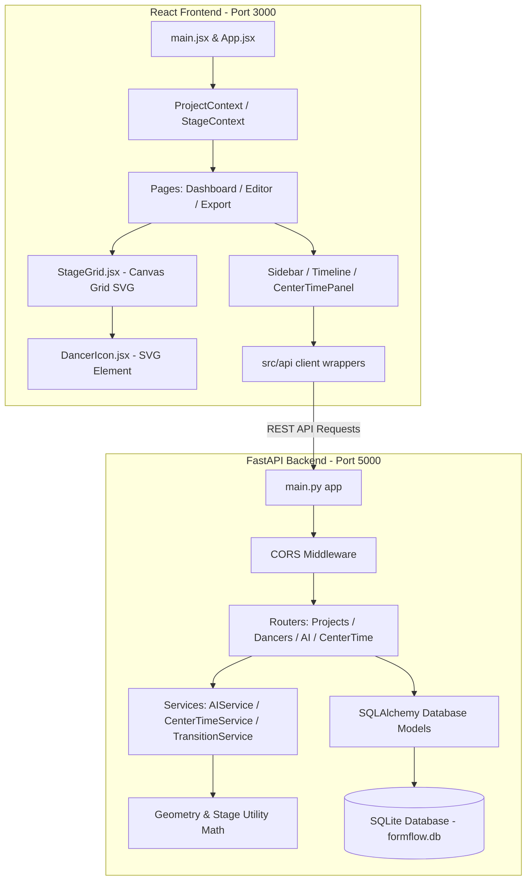

# FormFlow Architecture & Design Specification

This document lays down the technical architecture, coordinate mappings, and structural design pattern of **FormFlow**.

## System Overview



---

## 1. Stage Coordinate System Reference

To ensure matching visuals between the canvas layout and backend calculations, we use a shared, normalized relative grid system:

- **Origin `(0, 0)`**: Set precisely at the **center/focal point** of the stage. This matches the **Red X** icon.
- **Stage Limits**: 
  - **X Axis**: ranges from `-25.0` (Stage Left) to `+25.0` (Stage Right).
  - **Y Axis**: ranges from `-15.0` (Stage Down / Audience side) to `+15.0` (Stage Up / Backstage side).
- **Labels placement**:
  - **BACKSTAGE**: Placed on top (`Y = +15.0`).
  - **AUDIENCE**: Placed on bottom (`Y = -15.0`).

### Coordinate Translations (React frontend)

```javascript
// Translation logic from Normalized Stage grid to actual browser SVG Pixel Dimensions
const STAGE_GRID_WIDTH = 50.0; // [-25, +25]
const STAGE_GRID_HEIGHT = 30.0; // [-15, +15]

export function gridToPixel(gridX, gridY, canvasWidth, canvasHeight) {
  // Center translation offset
  const pixelX = ((gridX + 25.0) / STAGE_GRID_WIDTH) * canvasWidth;
  const pixelY = ((15.0 - gridY) / STAGE_GRID_HEIGHT) * canvasHeight; // Y is inverted in browser SVG (0 at top)
  return { x: pixelX, y: pixelY };
}

export function pixelToGrid(pixelX, pixelY, canvasWidth, canvasHeight) {
  const gridX = (pixelX / canvasWidth) * STAGE_GRID_WIDTH - 25.0;
  const gridY = 15.0 - (pixelY / canvasHeight) * STAGE_GRID_HEIGHT;
  return { x: gridX, y: gridY };
}
```

---

## 2. Technical Component Blueprint

### Client Module Design:
- **`StageGrid.jsx`**: Handles container resizing, SVG standard layouts, and drag-and-drop actions.
- **`DancerIcon.jsx`**: Animated SVG circular indicator that displays the dancer's designated number and color, rendering labels beneath.
- **`TransitionAnimator.jsx`**: Implements linear or Bézier easing transitions to animate dancer movements smoothly between consecutive timeline formations.
- **`CenterTimePanel.jsx`**: Monitors which dancers are positioned within the focal radius of `(0,0)`, dynamically displaying warnings or balanced percentages.

### Server Service Design:
- **`ai_service.py`**: Computes standard formation shapes (arcs, splits, circles, diagonals) using basic trigonometric transformations.
- **`center_time_service.py`**: Intersects dancer vectors with the central focal circle to compute exposure statistics across all timeline steps.
- **`transition_service.py`**: Utilizes standard cost-optimization algorithms (like the Hungarian method) to match source and target dancer positions, minimizing path overlap and crossings.
